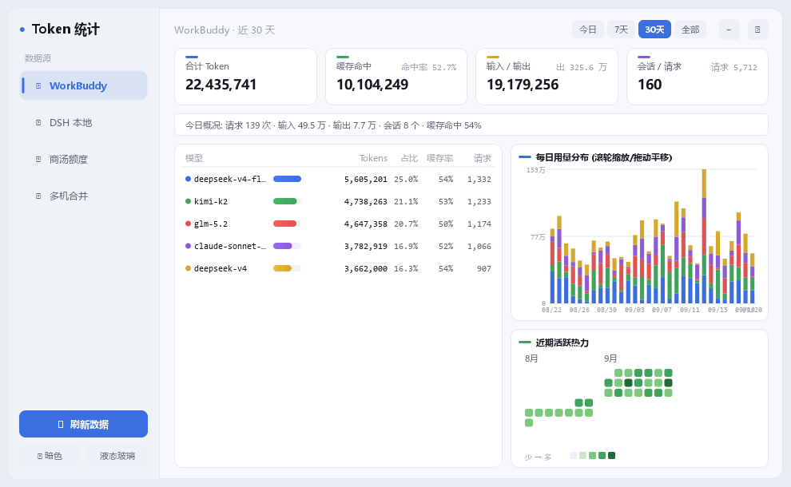
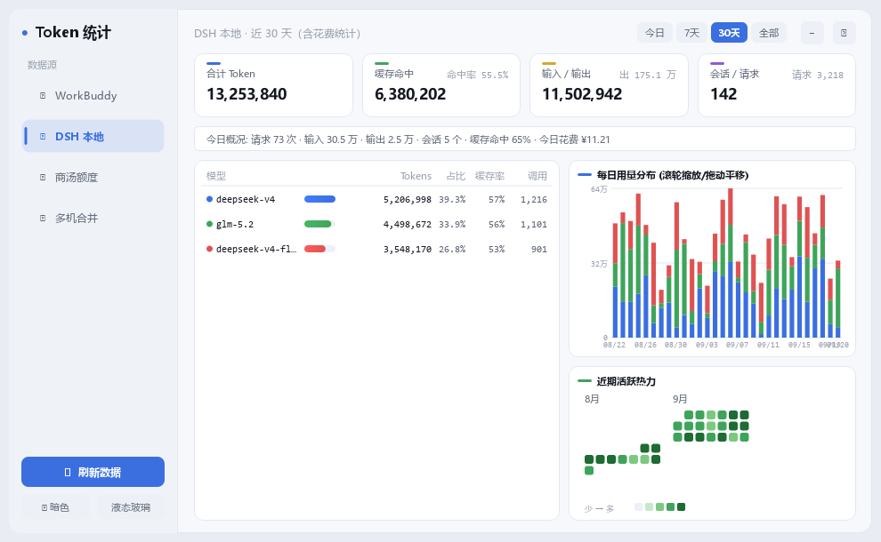
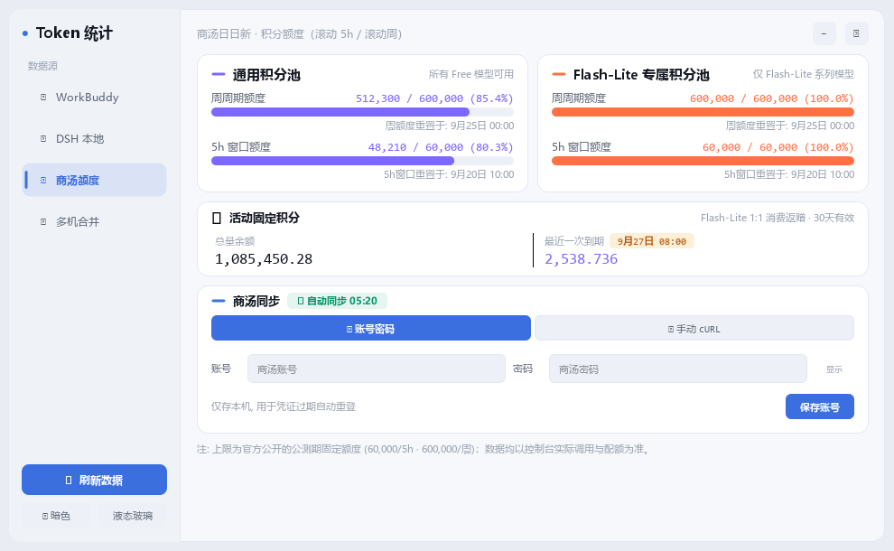
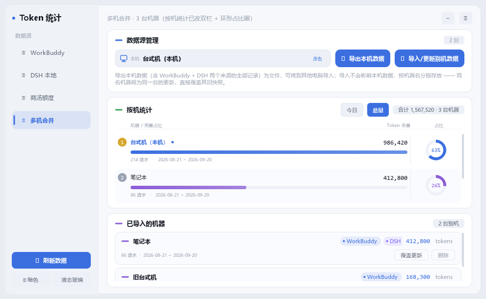
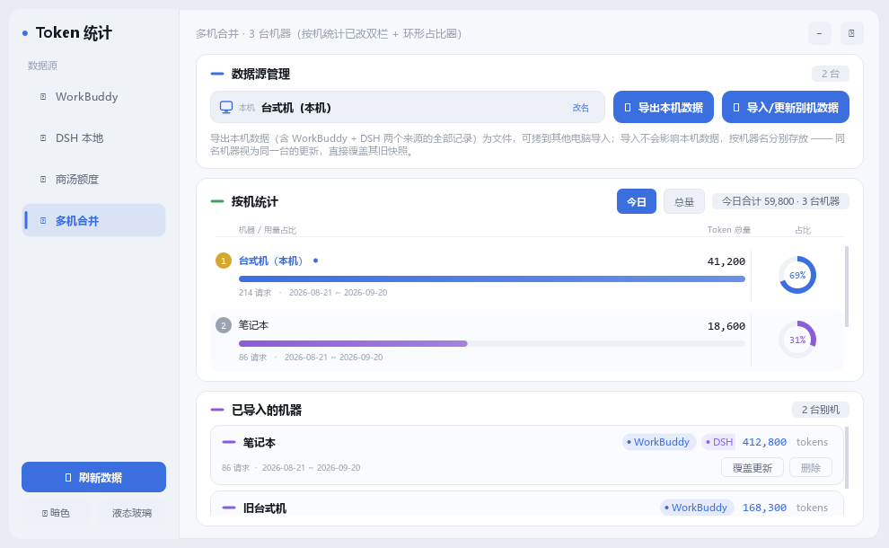
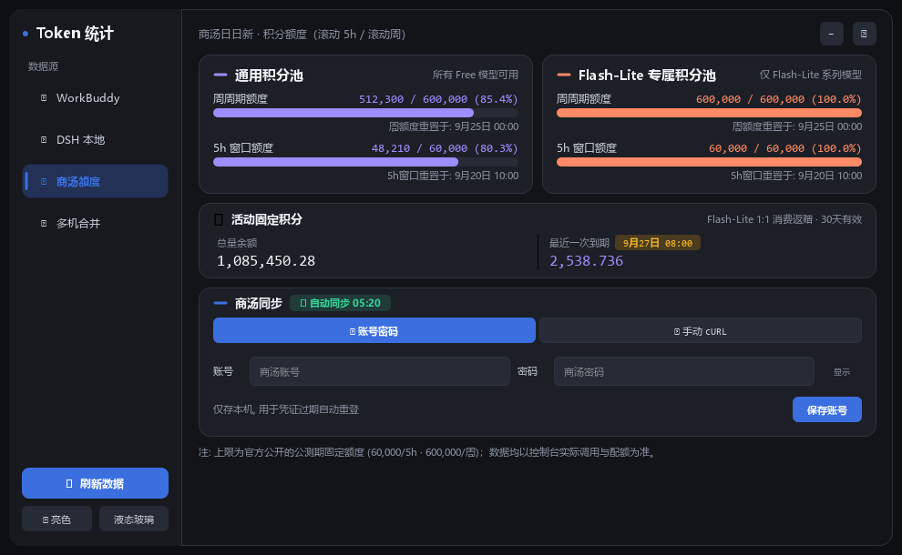
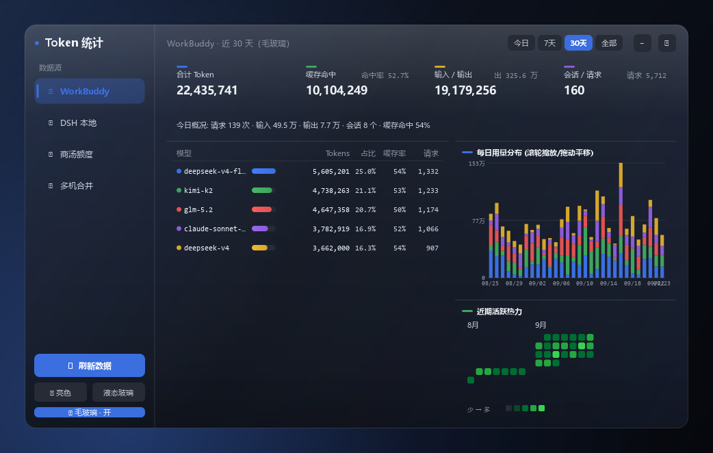
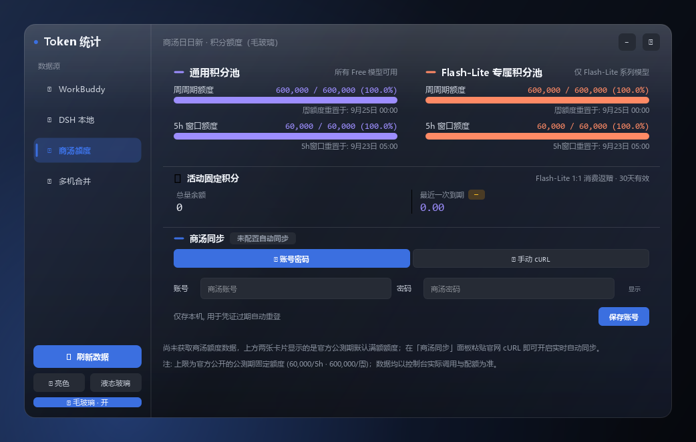
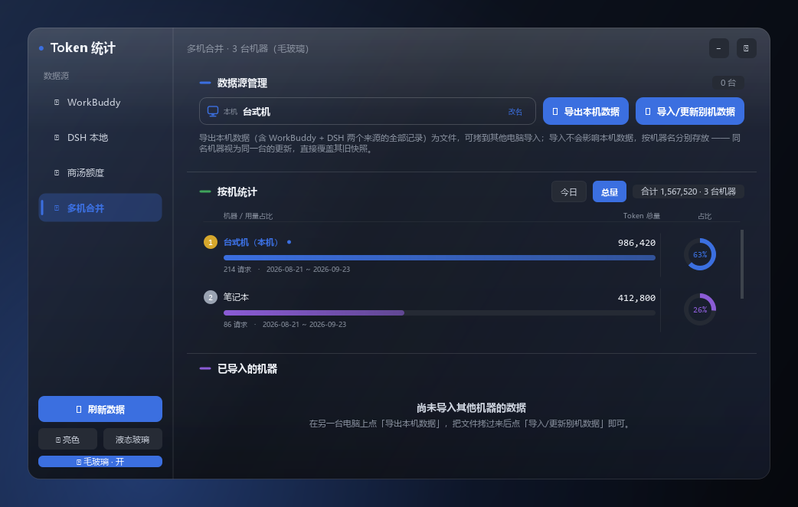
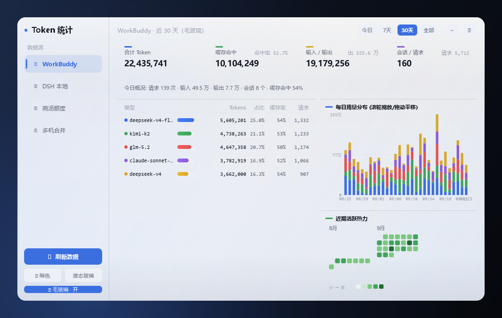

# Token 统计（Token Audit Card）

> 常驻桌面的 Token 用量审计浮窗：统计 WorkBuddy / DSH 本地会话的 Token 消耗，实时跟踪商汤（SenseNova / 日日新）积分额度，并支持多台机器的数据导出与合并。

| 项 | 值 |
|---|---|
| **当前构建** | `v9.3-frost` |
| **平台** | Windows（已验证；PySide6 本身跨平台，但启动脚本为 Windows 批处理） |
| **运行时** | Python 3.13 · PySide6 6.11.1 |
| **第三方依赖** | **仅 PySide6**（扫描 / HTTP / JSON / 打包辅助全部标准库） |
| **数据来源** | 本机 `~/.workbuddy/projects/**/*.jsonl` + DSH 账本 + 商汤控制台接口 |
| **代码仓库** | <https://github.com/Suqianqiana/token-stats>（默认分支 `main`） |

---

## What's New in v9.2

**Multi-Machine Sync** — build `v9.2-multi`

- **Export → Import → Merge.** Export one machine's complete WorkBuddy + DSH usage as a
  single JSON package, copy it over, and import it on any other machine.
- **Non-destructive by design.** Importing never touches local data or other machines'
  snapshots — every machine is stored separately under `peers/<machine>.json`.
- **One button, two semantics.** A machine name never seen before is added as a new
  machine; a name that already exists is treated as a newer snapshot of the same
  machine and **overwrites** its old data instead of double-counting.
- **Merged everywhere.** Once peers exist, the WorkBuddy / DSH pages include remote
  usage too (the subtitle marks how many peer machines were merged in).
- **Per-machine stats, redesigned.** Every machine is drawn as a two-column card: the
  familiar rank bar on the left, and a **share ring** on the right showing its true
  percentage of the total. A **Today / All-time** toggle re-ranks the whole list.
- **SenseNova quota cards are always present.** Before credentials or data are ready the
  two pool cards still render, using the official public-beta full quota as a
  placeholder, so the page never collapses into a block of text.

---

## 目录

- [一、项目简介](#一项目简介)
- [二、界面预览](#二界面预览)
- [三、功能详解](#三功能详解)
- [四、技术架构](#四技术架构)
- [五、数据与文件格式](#五数据与文件格式)
- [六、环境要求与安装](#六环境要求与安装)
- [七、启动与使用](#七启动与使用)
- [八、商汤积分自动同步配置](#八商汤积分自动同步配置)
- [九、打包与发布](#九打包与发布)
- [十、开发与调试](#十开发与调试)
- [十一、代码规范与视觉系统](#十一代码规范与视觉系统)
- [十二、GitHub 协作与跨机同步](#十二github-协作与跨机同步)
- [十三、目录结构](#十三目录结构)
- [十四、已知限制与注意事项](#十四已知限制与注意事项)

---

## 一、项目简介

「Token 统计」由两块组成：

- **悬浮球 / 桌宠**：常驻屏幕（置顶、可拖动、位置记忆），单击弹出统计卡片，右键打开菜单。
- **卡片窗口**：无边框圆角、液态玻璃主题、可拖动；内置四个数据源页签，支持深浅色与三档玻璃通透度。

四个数据源页签：

| 页签 | 内容 |
|---|---|
| **WorkBuddy** | 本机 WorkBuddy 会话的 Token 用量（按模型 / 按日） |
| **DSH 本地** | 本机 Deepseek-Harness-EAC 的用量与花费 |
| **商汤额度** | 商汤日日新积分池额度（滚动 5h / 滚动周），支持控制台接口自动同步 |
| **多机合并** | 多台机器的用量导出 / 导入 / 合并对比 |

设计取向：**本机数据始终实时扫描，不落快照**；别机数据以文件快照形式常驻本机，随时可覆盖或删除。整个过程无后端、无账号体系、不联网（商汤同步除外，且仅在你主动配置后启用）。

---

## 二、界面预览

> 截图由 offscreen 渲染生成，使用**合成匿名数据**，不含任何真实用量与账号信息。

### WorkBuddy 页



### DSH 本地页



### 商汤额度页



### 多机合并页（按机统计：双栏 + 环形占比圈）



### 多机合并页 · 切到「今日」口径



### 深色主题（商汤页）



### 毛玻璃模式 · WorkBuddy 页（深色）



### 毛玻璃模式 · 商汤额度页



### 毛玻璃模式 · 多机合并页



### 毛玻璃模式 · 浅色（奶白磨砂）



### 桌宠形态（v3 素材）


---

## 三、功能详解

### 3.1 用量页（WorkBuddy / DSH）

- **四张汇总卡**：合计 Token、缓存命中（含命中率）、输入 / 输出、会话 / 请求。
- **今日概况条**：请求 / 输入 / 输出 / 会话 / 缓存命中率；DSH 页额外显示今日花费。
- **模型明细表**：按 Token 总量降序，含占比条、缓存命中率、请求数；DSH 页表头为「调用」。
- **每日用量堆叠图**：按日按模型堆叠，支持**鼠标锚点滚轮缩放 + 拖动平移**（每次刷新回到默认视图，不记忆上次的缩放/平移）。
- **活跃热力图**：GitHub 风格，按日着色。
- **时间区间**：`今日` / `7天` / `30天` / `全部`（商汤页与多机页隐藏该切换）。

### 3.2 商汤额度页

- **两张积分池卡**：通用积分池（紫）、Flash-Lite 专属积分池（橙），各显示**周周期额度**与 **5h 窗口额度**（剩余 / 总额 + 百分比 + 重置时间）。
- **活动固定积分卡**：总量余额 + 最近一次到期时间与到期额度。
- **积分卡常驻**：数据或凭证尚未就绪时，卡片仍固定显示，数值取**官方公测期默认满额**（见 §14 变更记录）；底部状态提示行此时才会出现，数据到齐后自动隐藏。
- **同步面板**：账号密码（用于凭证过期自动重登）+ 手动 cURL 两段式，支持就地保存 / 清除。

### 3.3 多机合并页

单列纵向三段：

1. **数据源管理** —— 本机机器框（点名字即可就地改名）+ 「导出本机数据」「导入 / 更新别机数据」。
2. **按机统计** —— 每台机器一行**双栏卡片**（中间以细竖线分隔）：
   - **左栏**（沿用原有呈现）：名次徽标、机器名（本机带蓝点）、Token 总量、用量占比条（**相对最大机器**归一）、请求数与数据区间；
   - **右栏**：**环形占比圈** —— 弧长表示该机占**全部机器总量**的真实百分比，圆心写百分比数字；
   - **口径切换**：面板头右侧的 **今日 / 总量** 分段按钮可整列重新排名（今日 = 当天用量；某台机器当天没同步过即显示 0，整列全 0 时给空态文案）；
   - 顶部显示当期合计与机器数。
3. **已导入的机器** —— 别机快照列表（来源徽标、导入时间），每行可 **覆盖更新** 或 **删除**。

**导入语义（一个按钮覆盖两种情形）：**

| 情形 | 行为 |
|---|---|
| 包内机器名**从未出现过** | 作为**一台新机器**加入统计 |
| 包内机器名**已存在** | 视为同一台机器的新快照，**覆盖其旧数据**（不是累加） |

导入**绝不影响本机数据**，也不影响其他机器的快照。存在别机数据时，WorkBuddy / DSH 页也会把别机数据一并计入（副标题标注「含 N 台别机」）。

### 3.4 桌宠形态

双击悬浮球或右键菜单「打开面板」进入统计面板；右键菜单可在四个素材主题间切换：

| 主题键 | 名称 | 素材目录 |
|---|---|---|
| `v1` | 经典素材（旧版） | `assets/pet` |
| `v2` | 新版素材（高清） | `assets/pet_v2` |
| `v3` | 最新素材（与原版合并） | `assets/pet_v3r` |
| `v4` | deepseek娘V4Pro | `assets/pet_v4` |

八组动画 `PET_ANIMS`：`idle` / `sleep` / `wake` / `drag` / `click` / `sidle` / `pat` / `special`。
点击分区按**角色实际绘制区**（`_pet_draw_rect`）的 1/3 划分：**顶部 1/3 为摸摸头，底部 2/3 为点击**。

### 3.5 交互与主题

- **双尺寸**：标准模式 `990×610` / 舒适大窗口 `1180×730`，字重与行高分别标定，不做粗暴放大。
- **三档玻璃通透度**：`晶透水滴（高通透）` / `标准液态（推荐）` / `柔和微透（防眩光）`。
- **深浅色**：全程序统一调色板，切换后所有自绘控件同步刷新。
- **毛玻璃模式（Frost）**：第二种材质，与"液态玻璃"并列，可与深浅色自由叠加；两者**互斥**（再点一次已选中的按钮即回到默认）。
  - **静态内置磨砂底纹**：底纹是一张**糊好的图**（`assets/frost_bg.png`，内置壁纸经**真高斯模糊**+去饱和），
    运行时零抓屏、零延迟、拖拽完全跟手；也可自选任意图片（右键「窗口材质 → 选择底纹图片…」，自动做同样处理）。
  - **为什么必须是"真高斯"**：早期用"缩到 1/45 再放大 45 倍"近似，放大是双线性插值 → 采样边界留下**周期性折痕**，
    高分辨率底图会被看成一块一块的**色块**。现改用 `QGraphicsBlurEffect` 在同一尺度上卷积（半径按工作分辨率给定，
    四周以镜像 padding 兜住边缘），既糊得干净又没有折痕。
  - **卡片退化为细线分区**：页面里的"卡片"不再铺底、不再描边，只在顶部画 **1px 细线**；
    横向并排的一组（四张指标卡、商汤两张积分池卡）不各画线。列表同时**关掉斑马纹**。
  - **浮层仍然实体**：自绘弹窗与主板照旧铺磨砂底，否则会"隐形"在玻璃上。
  - **控件跟着材质换语言**：侧栏按钮与标题栏 `–` `✕` 按材质分档 —— 默认＝实底芯片、液态玻璃＝半透明高光片＋亮描边、
    毛玻璃＝近乎无底＋极淡细线（悬停只给一层薄雾），避免"透明玻璃上贴着实心色块"的突兀感。
    按钮**选中态**在毛玻璃下**从底图取色**（取底图平均色的色相，饱和度/明度归一到可读区间），半透明填充＋同色描边；
    左栏「来源」导航的选中态（填充/竖条/描边/文字）**同样取底图色**，于是毛玻璃下全窗只有一个色源；
    液态玻璃与默认档仍用品牌蓝。两种材质**直切**（毛玻璃 ⇄ 液态玻璃）不会掉回默认模式。
  - 入口：右键菜单「🪟 窗口材质」、悬浮球右键菜单，或侧栏「液态玻璃 | 毛玻璃」按钮；选择会**落盘记忆**。
- **单一实例**：重复启动不会起第二个常驻实例。
- **一键重启 / 开机自启**：见 §7。

---

## 四、技术架构

### 4.1 分层与模块职责

| 层 | 文件 | 职责 |
|---|---|---|
| 数据采集 | `scanner.py` | 遍历 `~/.workbuddy/projects/**/*.jsonl`，解析 `providerData.usage`；按 **mtime+size 增量**（`cache.json`），聚合落 `stats.json`。纯标准库 |
| 数据采集 | `card_app.load_dsh_stats()` | 读取 DSH 账本并聚合。⚠️ **不返回 `models`**（需现算）——统计 DSH 用量必须走 `peer_store.normalize_source()` |
| 数据合并 | `peer_store.py` | 多机快照的导出 / 导入 / 覆盖 / 合并；`merge_machines()`（跨来源总览）与 `source_view()`（**单来源**合并）。纯标准库 |
| 商汤数据 | `card_app` 商汤段 + `sn_login.py` / `sn_autologin_fetch.py` | 本地估算 + 控制台接口同步；JWT 解析与提前续期；cURL 零指纹字段探测 |
| 界面 | `card_app.py` | 全部 UI（卡片 / 悬浮球 / 桌宠 / 弹窗 / 图表）、主题系统、线程与缓存调度 |
| 启动 | `launcher.py` | 轻量启动器（不含 PySide6，8~10MB exe）：定位项目目录与 `pythonw.exe`，`DETACHED + CREATE_NO_WINDOW` 拉起主程序后立即退出 |
| 回归 | `test_switch_race.py` | offscreen 回归测试，**当前 391 项断言**，需全绿 |

### 4.2 数据流

```
WorkBuddy jsonl ──► scanner.scan_full() ──┐
                                          ├─► CardWindow.refresh()（后台线程）
DSH 账本 ─────────► load_dsh_stats() ─────┤        │
                                          │        ▼
商汤控制台接口 ───► sn_autosync_fetch() ──┘   _on_scan_done(src, stats)
                                                      │
                    peer_store.merge_machines() ◄─────┤（多机快照参与合并）
                    peer_store.source_view()    ◄─────┤
                                                      ▼
                                        按来源缓存（如 `_sn_cache`）→ render()
```

关键约定：

- **切页与渲染解耦**：`_apply_page()` 只做 `setCurrentIndex` / 可见性；`render()` 由数据回调触发。历史上 `setCurrentIndex` 只写在 `render()` 里，导致"同步过程中无法切页"。
- **迟到结果丢弃**：长任务带代次/序号，看门狗超时后旧线程的返回不会覆盖新状态。
- **首帧骨架**：多机页首帧画**同高骨架行**而非空态文案，避免数据到位后整列"唰一下长出来"。
- **本机不落快照**：本机永远实时扫描；导出的只是一次性副本。

### 4.3 关键实现要点

- **打包资源解析**：未打包时 `APP_DIR` = 脚本目录；已打包时优先取 **exe 同级 `assets/`**（把素材放 exe 旁边即可替换，无需重新打包），否则回退到包内（`sys._MEIPASS`）。
- **spawn 子进程前剥离 `_PYI_*` 环境变量**：PyInstaller onefile 的子进程引导器会校验「父进程可执行文件是否与自己一致」，`exe → launcher → pythonw` 一路继承后会误判并拒启（`card_app._clean_spawn_env()` 与 `launcher.py` 两处都要清）。
- **商汤事件缓存**：`sn_events_cache.json` 按 `size+mtime` 失效，把商汤页刷新从 ~14.4s 降到 ~0.16s（冷启动首次数秒）。

---

## 五、数据与文件格式

### 5.1 落盘位置

全部运行期数据位于 `~/.workbuddy/plugins/data/token-usage-stats/`（**不在仓库内**）：

| 文件 | 内容 |
|---|---|
| `cache.json` | 扫描增量游标（文件 mtime + size） |
| `stats.json` | WorkBuddy 聚合结果（每日 / 每模型明细） |
| `settings.json` | 界面与主题设置（见 §5.2） |
| `machine.json` | 本机机器名（可改名） |
| `sn_autosync.json` | 商汤同步配置（cURL / 账号）与最后已知值 |
| `sn_token.json` | 商汤 JWT 与解析出的过期时间 |
| `sn_cred.log` | 商汤凭据链路轻量日志（走了哪条路 / 耗时 / 成败） |
| `sn_events_cache.json` | 商汤事件磁盘缓存 |
| `peers/index.json` | 别机注册表 |
| `peers/<机器名>.json` | 各别机快照（文件名经安全化处理） |

### 5.2 `settings.json`

实际落盘的就是内存里的 `theme_state`：

```json
{
  "dark": false,
  "glass": false,
  "source": "wb",
  "pet": false,
  "pet_theme": "v3",
  "window_size": "default",
  "glass_transparency": "balanced"
}
```

> ⚠️ 一次性迁移的**标记位必须写进这个结构**，否则 `save_settings()` 一落盘就丢，迁移会每次启动重跑（曾把用户新选的主题反复改回旧值）。

### 5.3 导出包格式（`token-stats.peer/1`）

```json
{
  "format": "token-stats.peer/1",
  "version": 1,
  "app": "Token 审计卡片",
  "exported_at": "2026-09-19T03:30:00",
  "machine": "台式机",
  "sources": {
    "wb":  { "...scanner.scan_full() 完整返回..." },
    "dsh": { "...load_dsh_stats() 完整返回..." }
  }
}
```

改动 `FORMAT_ID` 或字段名时，务必同步更新回归测试 fixture 与本文档。

### 5.4 商汤额度口径

| 项 | 值 |
|---|---|
| 5h 窗口 | 以 0 点为起点的**固定 5 小时分块**（00–05、05–10、10–15、15–20、20–24） |
| 池 5h 上限 | `60,000` |
| 池周上限 | `600,000`（7 天滚动周，内部锚点 `2026-08-28`） |
| 凭证类型 | JWT（RS256），寿命 **3 小时**；剩余 < 120s 直接提前续期 |
| 自动刷新 | 每 **5 分钟**（`SN_AUTOSYNC_TTL = 300`）；点 ⟳ 可强制绕过 |
| 凭据域名 | 必须是 `sensenova.cn`，否则视为无效 |
| 界面口径 | 大数字 = 本周余额；进度条/左侧数字 = 5h「剩余 / 总额」；百分比 = 剩余占比 |

> 「已用」是按本地 WB / DSH 调用次数估算的（非官方口径），页面页脚与 tooltip 已标注。

---

## 六、环境要求与安装

- **操作系统**：Windows（PySide6 可行于其他平台，但启动脚本仅提供 Windows 批处理）
- **Python**：3.13（本项目使用托管运行时，无需自行安装）
- **虚拟环境**：`~/.workbuddy/binaries/python/envs/pyside6`，已含 **PySide6 6.11.1**
- **依赖安装**：**无需 `pip install`**，venv 已就绪
- **素材**：`assets/` 随仓库提供（含四套桌宠素材与图标）

---

## 七、启动与使用

### 7.1 启动

双击以下任一启动器：

| 脚本 | 说明 |
|---|---|
| `start_card.bat` | 规范入口 |
| `启动统计悬浮球.bat` | 中文别名（内容相同） |
| `启动统计悬浮球.vbs` | **静默启动**，不弹控制台窗口（日常推荐） |
| `TokenStats.exe` | 打包产物，双击即用（图标正式，便于放桌面） |

启动后：出现悬浮球 → **单击**弹出卡片；标题栏可拖动；`–` 最小化、`✕` 隐藏（不退出）。

### 7.2 常用脚本

| 脚本 | 作用 |
|---|---|
| `enable_autostart.bat` | 在「开始菜单 → 启动」创建快捷方式，开机自启 |
| `桌面图标指向exe.bat` | 在桌面创建指向 exe 的快捷方式 |
| `商汤自动登录.bat` | 单独跑一次商汤登录（获取 / 刷新凭证） |
| `重新打包exe.bat` | 重新打包主程序 exe |
| `推送到GitHub.bat` | GitHub 首次授权 + 推送（见 §12） |

---

## 八、商汤积分自动同步配置

商汤官方**未提供积分查询 API**，本工具通过抓取官网控制台接口实现自动同步：

1. 浏览器打开商汤控制台「积分额度」页；
2. 按 **F12** → **Network（网络）**；
3. 刷新页面，找到响应中含积分数字的请求（如 `tokenplan/pool-usage`）；
4. 在该请求上 **右键 → Copy → Copy as cURL**；
5. 回到工具「商汤额度」页的 **商汤同步** 面板，粘贴 cURL，点击 **保存并测试**；
6. 字段由程序**零指纹结构探测**自动识别，**无需手动填写任何数字**。

可选：在「账号密码」分支填入商汤账号密码，凭证过期时程序会自动重登（仅存本机）。

> - 凭证（JWT）约 **3 小时**过期；过期且无账号密码时，余额回退到**本地估算**并提示重新抓包。
> - 程序每 **5 分钟**自动刷新；切页也会按频控刷新，点 `⟳` 立即强制刷新。

---

## 九、打包与发布

```bash
# 主程序单文件 exe（产物：<构建目录>/dist/TokenStats.exe，并复制一份到桌面）
python tools/build_exe.py
python tools/build_exe.py --onedir     # 目录模式：体积更大但启动更快

# 轻量启动器（不含 PySide6，8~10MB）
python tools/build_launcher.py

# 生成应用图标（assets/app_icon.ico / .png）
python tools/make_app_icon.py
```

打包约定：

- **只打包"在用"的素材**：`assets/pet`、`pet_v2`、`pet_v3r`、`pet_v4` 与 `app_icon`。
  备份 / 实验目录（如 `pet_alt`、`pet_v3_add`、`pet_v5*`、`*_bak_*`）**不进包**，否则体积白白翻几倍。
- 图标单一来源 `assets/app_icon.ico`：exe 图标、任务栏、托盘三处统一。
- 构建临时目录优先放 **D 盘**（经 `TMP`/`TEMP` 传给 PyInstaller 子进程），避免塞满 C 盘。

---

## 十、开发与调试

### 10.1 常用命令

```bash
# 运行主程序（pyside6 venv 的 pythonw，无控制台窗口）
~/.workbuddy/binaries/python/envs/pyside6/Scripts/pythonw.exe card_app.py

# 单独调试扫描引擎（输出聚合摘要）
~/.workbuddy/binaries/python/envs/pyside6/Scripts/python.exe scanner.py --force

# 全量语法检查（内存编译，不写 .pyc）
~/.workbuddy/binaries/python/envs/pyside6/Scripts/python.exe tools/syntax_check.py

# 回归测试（必须在 offscreen 下运行）
QT_QPA_PLATFORM=offscreen \
  ~/.workbuddy/binaries/python/envs/pyside6/Scripts/python.exe test_switch_race.py
```

`tools/` 其余脚本：

| 脚本 | 作用 |
|---|---|
| `syntax_check.py` | 全项目语法检查（内存编译，不落 `.pyc`） |
| `restart_app.py` | 重启卡片应用（改动生效） |
| `metrics_regression.py` | 素材指标回归 |
| `build_exe.py` / `build_launcher.py` / `make_app_icon.py` | 打包与图标 |

### 10.2 回归测试覆盖

切页 race 防护、同步数学、cURL 解析（bash / cmd）、指纹与零指纹探测、真实接口 fixture、单列渲染、窗口位置统一、代理 10061 直连重试、多机数据源（导出 / 导入 / 合并 / 覆盖 / 命名）、导入语义（新增 vs 覆盖）、视觉基座（按钮工厂 / 自绘弹窗 / 导航自绘 / 主题联动 / 排行条）、暗色输入框、内联改名、骨架占位行、商汤页池卡常驻与占位满额、按机统计双栏（环形占比口径 / 今日·总量切换 / `metric` 命名守门）、毛玻璃模式（材质互斥三态 / 纹理连续性 / 开关落盘）、底纹真高斯（均匀图不产生暗边 / 衰减曲线不是线性斜坡）、按钮材质分档（三档样式互异）、每日分布不再记忆缩放视图、按钮选中态底图取色（含左栏「来源」导航）与材质直切 —— **391 项断言，需全过**。

> 测试开头备份、结尾还原用户真实配置；商汤 / settings / peers 全部隔离到临时目录，**不得写入真实数据目录**。

### 10.3 offscreen 截图 / 渲染技巧（踩坑记录）

1. Qt 找不到系统字体 → 手工 `QFontDatabase.addApplicationFont()` 注册 `C:\Windows\Fonts\msyh.ttc` 等，否则中文全是豆腐块。
2. `render()` 里旧控件走 `deleteLater()`，而 `processEvents()` **默认不处理 DeferredDelete** → 旧控件从布局摘除后仍是子控件、留在原位继续绘制，会画成「表头与首行重叠」的假象。截图前需 `QCoreApplication.sendPostedEvents(None, QEvent.DeferredDelete)`。
3. 图表（`StackedBarChart`）每次 `set_data` 都会复位到默认视图（第64轮已移除"记住缩放/平移"的记忆），截图无需再手动复位。
4. `widget.grab()` 对透明窗口**保留 alpha**，可直接叠到自选背板上；若发现角落被合成成实色，先查 alpha 是否被覆盖。
5. ⚠️ **不要用 Qt 虚函数名做实例属性名。** `QWidget` 继承自 `QPaintDevice`，而 `QPaintDevice::metric()` 是虚函数 ——
   PySide6 会把它当"Python 覆写"去取 `self.metric` 调用。一旦写成 `self.metric = "total"`（字符串），
   构造 `QPainter(self)` 时就会抛
   `Error calling Python override of QWidget::metric(): 'str' object is not callable`，
   并且**进程直接 abort（不是可捕获的普通异常）**。同类危险名字：`event` / `sizeHint` / `paintEvent` / `metric`。
6. ⚠️ **Python 覆写里抛异常 = 硬崩溃。** 上一条的 abort 本质是"paintEvent 内抛了异常"。
   排查手法：把被覆写的方法用 `try/except` 包一层并打印 traceback，异常就能现形；
   另外 `faulthandler` 只会打出**当前 Python 栈**，若崩在纯 C++ 路径（如 `drawArc` 之类内部），
   栈里不会出现我们的帧 —— 这时优先怀疑"某个被覆写方法抛了异常"。

### 10.4 语法检查与杀软误报

本项目的开发环境装有国产杀软，会把 `__pycache__/*.pyc` **误判为木马并连带结束进程**，症状是「命令退出码 0 但零输出」或"进程莫名消失"。因此：

- 语法检查一律走 `tools/syntax_check.py`（内存 `compile()`，不落 `.pyc`），**不要用 `python -m py_compile`**；
- 任何 `import card_app` 的脚本开头加 `sys.dont_write_bytecode = True`，或命令行加 `-B`；
- 根治办法是把项目目录加入杀软信任区。

---

## 十一、代码规范与视觉系统

### 11.1 提交与版本

- 提交信息格式：`第N轮：<一句话说明>`；**定点 `git add`**，不要 `add -A`。
- 每轮先更新根目录 [`协作进度.md`](协作进度.md)（演进历程 + 协作者备注），提交紧随其后。
- 版本标识：`card_app.py` 内 `APP_BUILD`（当前 `v9.3-frost`）。

### 11.2 按钮：四档统一工厂

所有按钮经 `make_btn(kind, text)` 创建、`style_btn(btn, ...)` 重刷：

| kind | 用途 | 外观 |
|---|---|---|
| `primary` | 面板主操作（导出 / 保存 / 删除确认） | 实心蓝底白字，hover 加深 |
| `ghost` | 次要操作（改名 / 覆盖更新） | 透明底 + 描边，hover 转蓝 |
| `danger` | 破坏性操作（删除） | 同 ghost，hover 转红 |
| `icon` | 标题栏轻量开关 | 无边框，仅 hover 底色 |

改主题或字号后**必须重调 `style_btn`**，否则颜色不跟随。

### 11.3 弹窗：一律自绘

`QMessageBox` / `QInputDialog` 已全部替换为 `GlassDialog`（**真正的 `QDialog` 子类**，玻璃底 + 菲涅尔描边 + 语义徽章 + 可拖拽标题区 + `Esc` 取消 / `Enter` 确认）。上层封装：

- `dlg_confirm()` → bool
- `dlg_notify()` → 单按钮通知
- `dlg_prompt()` → (text, ok)

> 基类必须是 `QDialog`：早期用 `QFrame` + 手写事件循环"假装"模态，实测 `isModal()` 为假、`adjustSize()` 算不出 `sizeHint`，**表现为弹窗根本看不见**。

### 11.4 输入框：与商汤页同源

输入类控件的视觉配方统一为 **`TRACK` 填充 + `BORDER` 细描边（圆角 6）+ focus 转蓝**。
靠"填充与卡片底的明度差"读出输入框感，而不是靠粗 / 艳的描边——这是"边缘清晰"的关键。

### 11.5 卡片、导航与主题联动

- 卡片底板用 `GlassPodFrame(radius=12)`；面板头 = `BarIndicator` 小细条 + 加粗标题 + 说明胶囊。
- `NavButton` 纯自绘（左侧 3px 选中竖条 + 22px 图标槽），新增数据源要把按钮加进 `apply_styles` 的**所有**循环。
- `set_dark` / `set_glass` 只调 `update()` **不会重算 QSS**，子页面必须经 `_refresh_subpages_theme()` 显式重刷。
- 局部 `setStyleSheet` 会**替换**该子树继承的全局 QSS（不是叠加）→ 滚动条样式必须打包重设（`style_scroll_area()`）。
- 自绘控件颜色一律取全局调色板（`TEXT` / `TEXT2` / `TEXT3` / `BORDER` / `TRACK` / `HOVER` / `ZEBRA`），**不要缓存到实例属性**。
- 列表重绘必须清空**全部** layout item（含 spacer）；`deleteLater()` 的旧控件不会立即消失。
- **控件样式要跟着材质走**（第64轮）：`material_btn_qss(role, dark, glass, frost)` 按「默认 / 液态玻璃 / 毛玻璃」
  三档生成按钮 QSS，`role` ∈ `primary`（主操作）/ `opt`（选项）/ `mat`（材质按钮）/ `icon`（标题栏）。
  新增按钮请走这个工厂，别再写死一套实底样式 —— 否则在透明材质下就是"贴上去的色块"。
  `NavButton` 是自绘控件，材质适配写在 `paintEvent` 里（hover 填充的 alpha 按材质给）。

---

## 十二、GitHub 协作与跨机同步

代码托管在 <https://github.com/Suqianqiana/token-stats>，默认分支 **`main`**。

### 12.1 首次接入（另一台机器）

```bash
git clone https://github.com/Suqianqiana/token-stats.git
cd token-stats
git config user.email "318013379+Suqianqiana@users.noreply.github.com"   # 提交才能关联账号
git config user.name  "浅浅猫"
```

推送 / 拉取需要 GitHub 凭据：双击 **`推送到GitHub.bat`**（走浏览器授权，凭据进 Windows 凭据管理器，只需一次）；或使用 Personal Access Token（fine-grained PAT 需开启 `Contents: Read and write`）。

### 12.2 日常节奏

**开工先 `git pull`，收工 `git push`**；只在 `main` 上协作。

### 12.3 三条硬规矩

1. **禁止 `rebase` / `amend` 已推送的提交** —— 一旦重写历史，另一台机器的 commit hash 全部对不上。
2. **`_archive/` 永远不随 git 同步**（在 `.gitignore` 里）—— 换机器需要归档内容时得单独拷贝。
3. **本机运行期数据不在仓库里**（`~/.workbuddy/plugins/data/token-usage-stats/`）—— 跨机共享用量走程序内「导出 / 导入别机数据」。

---

## 十三、目录结构

```
token-stats/
├── card_app.py             # 主程序：UI + 主题系统 + 商汤同步 + 桌宠（当前 v9.3-frost）
├── scanner.py              # WorkBuddy 增量扫描聚合（cache.json / stats.json）
├── peer_store.py           # 多机数据源：导出 / 导入 / 覆盖 / 合并（纯标准库）
├── launcher.py             # 轻量启动器源码（不含 PySide6）
├── sn_login.py             # 商汤登录
├── sn_autologin_fetch.py   # 商汤积分抓取
├── test_switch_race.py     # offscreen 回归测试（391 项断言）
├── 协作进度.md              # ★ 主协作文档：架构 / 演进历程 / Git 规范 / 协作者备注
├── README.md               # 本文件
├── .gitignore              # 版本库排除规则
├── TokenStats.exe          # 打包产物（单文件）
├── start_card.bat               # 启动器（规范名）
├── 启动统计悬浮球.bat            # 启动器别名
├── 启动统计悬浮球.vbs            # 静默启动（日常推荐）
├── enable_autostart.bat         # 开机自启
├── 桌面图标指向exe.bat           # 桌面快捷方式
├── 商汤自动登录.bat              # 商汤登录入口
├── 重新打包exe.bat               # 重新打包 exe
├── 推送到GitHub.bat              # GitHub 首次授权 + 推送
├── assets/                 # 现役素材
│   ├── pet/                #   v1 经典素材
│   ├── pet_v2/             #   v2 新版素材（高清）
│   ├── pet_v3r/            #   v3 最新素材（与原版合并，含 _saturation.json 调色标记）
│   ├── pet_v4/             #   v4 deepseek娘V4Pro
│   ├── pet_alt/            #   退役帧存档（测试依赖，勿动）
│   ├── pet_v3_add/         #   补充帧源（测试依赖，勿动）
│   ├── app_icon.ico / .png
│   └── *_qc.json / *_windows.json   # 各版本 QC 质检参考文件
├── docs/
│   ├── 素材饱和度优化.md
│   ├── V3补充素材清单.md
│   └── assets/previews/    #   界面预览图（README 引用）
├── tools/                  # 现役脚本（6 个）
│   ├── syntax_check.py
│   ├── restart_app.py
│   ├── build_exe.py
│   ├── build_launcher.py
│   ├── make_app_icon.py
│   └── metrics_regression.py
└── _archive/               # 归档区（不入版本库，见 _archive/README.md）
    ├── assets-debug/           # 根级调试截图
    ├── assets-pet-legacy/      # 桌宠历史版本
    ├── docs-reviews/           # 历史审查页
    ├── root-legacy/            # 根目录历史物
    └── tools-once/             # 一次性诊断脚本
```

**归档约定**：历史备份、调试中间产物、一次性脚本、废弃审查页一律放进 `_archive/` 对应分类，**不进版本库**；项目内只保留「跑起来必需 + 当前在维护」的东西。清单与取回方法见 [`_archive/README.md`](_archive/README.md)。

---

## 十四、已知限制与注意事项

1. **商汤无官方 API**：额度靠抓取控制台接口，控制台改版可能失效；凭证 3 小时过期，需账号密码或重新抓包。
2. **Windows 专用启动脚本**：`.bat` / `.vbs` 仅 Windows 可用。
3. **仓库当前为公开（public）**：仓库内含桌宠素材与预览图。如需私有，在仓库 **Settings → Danger Zone → Change visibility** 调整。
4. **`_archive/` 与运行期数据不随 git 走**：换机器时归档内容需单独拷贝；用量数据走程序内导出 / 导入。
5. **变更记录**：
   - **v9.3-frost（2026-09-25 第66轮）**：左栏「来源」`NavButton` 选中态在毛玻璃下**也从底图取色**（填充/描边/竖条/文字四处统一，默认与液态玻璃档仍是品牌蓝）；默认底纹换成新壁纸（`assets/frost_bg.png` 重新生成，粉调 → 毛玻璃选中态取色为 #d77a8a / #9e5a65）。
   - **v9.3-frost（2026-09-25 第65轮）**：日期区间按钮**尺寸还原**（`range` 角色 `padding:3px 8px` + 1px 描边 ≡ 旧版 `4px 9px` 无描边）；按钮**选中态在毛玻璃下从底图取色**（`FrostTexture.accent()`：取底图平均色的色相 + 半透明填充 + 同色描边，比左栏「来源」选中态稍实），液态玻璃选中态一并更通透（0.92 → 0.62）；修掉**两个材质直切会掉回默认模式**的 bug（回写勾选态必须 `blockSignals`）。
   - **v9.3-frost（2026-09-25 第64轮）**：底纹模糊改为**真高斯**（`QGraphicsBlurEffect` + 镜像 padding），修掉"高分辨率底图色块感"（旧"缩到 1/45 再放大"会留下周期性折痕）；默认底纹换成**内置壁纸** `assets/frost_bg.png`（不再依赖首次抓屏，用户自选底纹已被 `.gitignore` 排除）；侧栏与标题栏按钮**按材质分档**（默认 / 液态玻璃 / 毛玻璃三套语言）；移除每日用量分布图"记住缩放平移"的记忆。
   - **2026-09-24 第62/63轮**：毛玻璃先改成实时抓屏真模糊（第62轮），随后定稿为**静态内置纹理**（第63轮，纹理由底板整块铺一次、卡片不画底色；彻底弃用 DWM System Backdrop —— 实测在 Qt 自绘透明窗口上只画不透明灰）。
   - **2026-09-23 第61轮**：新增**毛玻璃模式（Frost）**——`theme_state["frost"]` + 磨砂材质；`paint_pod()` 加 `role`（分区不铺底 / 浮层仍实体）；列表关斑马纹；`GlassPodFrame(rule=)` 控制分组卡是否画分区线；右键菜单与侧栏新增开关。
   - **v9.2（2026-09-20 第59轮）**：版本标识统一为 `v9.2-multi`（`card_app.py` 头部 docstring 原先停在 `V8.7`，本次一并对齐，并在 docstring 内补了英文特性说明）；多机页「按机统计」改为**双栏卡片**（左栏原有排行呈现 + 细竖线 + 右栏环形占比圈），新增 **今日 / 总量** 口径切换；数据层 `machine_summary()` 补 `today` 字段。
   - **2026-09-20 第58轮**：商汤页两张积分池卡改为**常驻渲染**（未就绪时用官方公测期默认满额占位，原提示文字下移至页面底部）；多机页机器框与内联改名输入框的描边改为「`TRACK` 填充 + `BORDER` 细描边」，与商汤页输入框同源。

---

## 附：相关文档

- 主协作文档：[`协作进度.md`](协作进度.md) —— 完整演进历程、架构演进、Git 规范、协作者备注
- 归档说明：[`_archive/README.md`](_archive/README.md)
- 素材调色记录：[`docs/素材饱和度优化.md`](docs/素材饱和度优化.md)
- 素材清单：[`docs/V3补充素材清单.md`](docs/V3补充素材清单.md)
